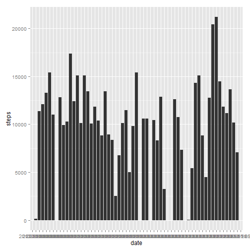

## Loading and preprocessing the data

1.First, load the file:


```r
data <- read.csv("activity.csv", stringsAsFactors=FALSE)
```


## What is mean total number of steps taken per day?

1.Calculate total number of steps taken per day:


```r
stepsByDay  <- aggregate(data$steps, by=list(data$date), FUN=sum, na.rm=TRUE)
names(stepsByDay)  <- c("date", "steps")
```
2.Plot histogram of steps per day:


```r
library(ggplot2)
ggplot(stepsByDay, aes(x=date,y=steps))+geom_bar(stat="identity")
```

 

3. Find mean and median of the total number of steps taken per day


```r
mean  <- mean(stepsByDay$steps, na.rm=TRUE)
median  <- median(stepsByDay$steps, na.rm=TRUE)

mean
```

```
## [1] 9354.23
```

```r
median
```

```
## [1] 10395
```

## What is average daily activity pattern?

1. Calculate and plot number of steps per five minute interval, averaged over each day


```r
stepsByInterval<- aggregate(data$steps, by=list(data$interval), FUN=mean, na.rm=TRUE)
names(stepsByInterval)  <- c("interval", "steps")
ggplot(stepsByInterval,aes(x=interval,y=steps))+geom_line()+xlab("Interval")+ylab("Steps")
```

 
2. Find interval with max average steps


```r
intervalWithMax <- stepsByInterval[stepsByInterval$steps == max(stepsByInterval$steps),1]

intervalWithMax
```

```
## [1] 835
```
